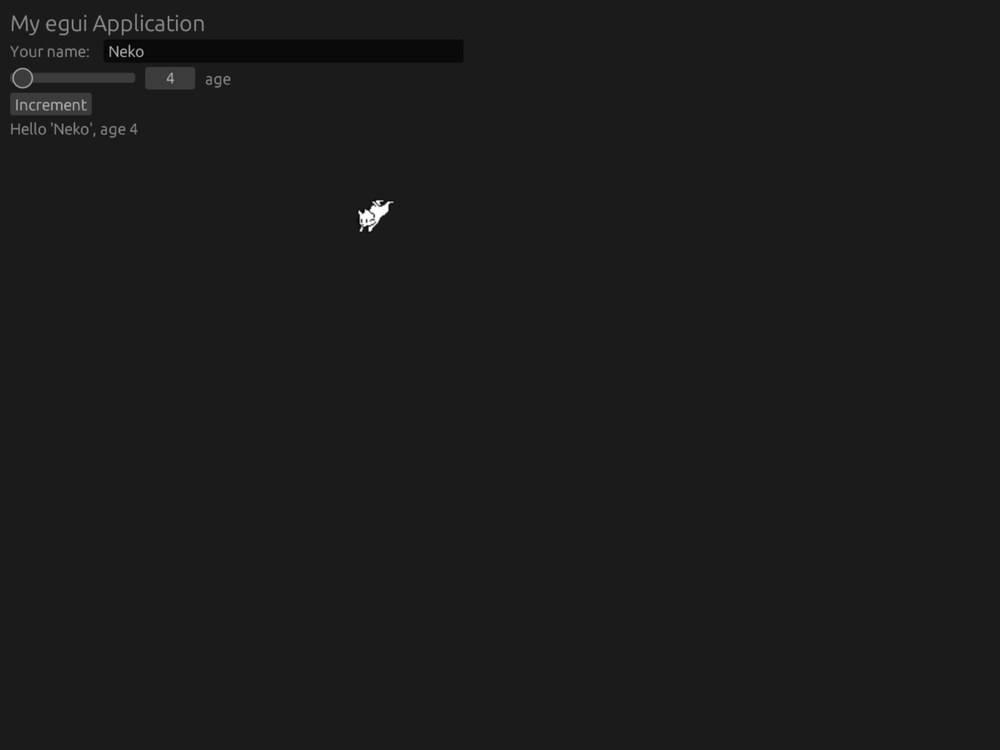

# Neko

This is a port of [Neko](https://en.wikipedia.org/wiki/Neko_(software)) to egui.

## Usage

See the examples. Make sure to install the image loaders.

You'll also likely want to request a repaint on each update so that the cat's
consistently redrawn.

## Stolen Code

The sprites are lifted straight from crgimenes' [neko
repository](https://github.com/crgimenes/neko/).

The example code is modified from that in the egui repository.

## Missing Features

I haven't implemented the waking animation or the clawing behavior yet. My aplogies :(
